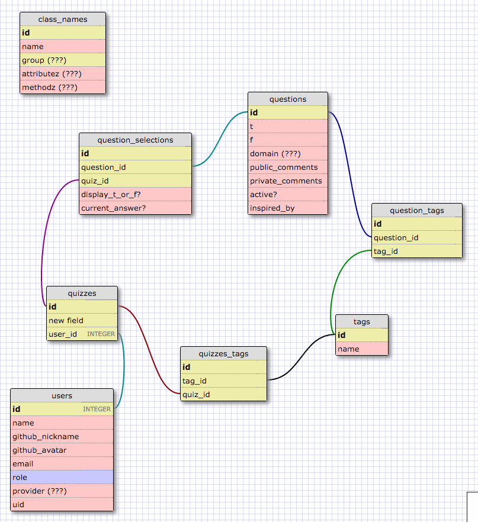

TRUE/FALSE SELF-QUIZ
====================

Schema
------

Requirements
------------

- Ruby 2.2.3
- Rails 5.0.0(beta3)
- Postgres

Contributing Code
-----------------
If you use this app and can think of ways to improve it, please do so!

* Pick a story from our [Trello board backlog](https://trello.com/b/wgbIjbj1/tf-quiz)
    * Or, write your own story; ask for write access to Trello board
* Create a new branch with a descriptive name
* Don't forget to write specs for it!
* When done, either
  * ...send a pull request
  * ...get a code review on your own, push to development, let bluemihai know
* This is a permissive contribution policy.  Please...
  * do not merge failing specs into development
  * do not push to master without checking in with bluemihai
* Notify bluemihai so he can merge into master and push into production

Setting Up Your Development Environment
---------------------------------------

* Rename database.example.yml to database.yml and fill it out
  * Make sure you have Postgres installed on your machine!
  * Use Postgres.app or brew install postgres (as opposed to your system default)
* Rename application.example.yml to application.yml and fill it out.
  * We are not currently emailing users, so don't worry about GMAIL_USERNAME
  * Create your own [local Github auth app](https://github.com/settings/applications/new)
    * Set Authorization callback URL to http://localhost:3000/auth/github/callback
* bundle install
* bin/rake db:setup
* bin/rails s
  * bundle exec guard
* bundle exec rspec spec/
